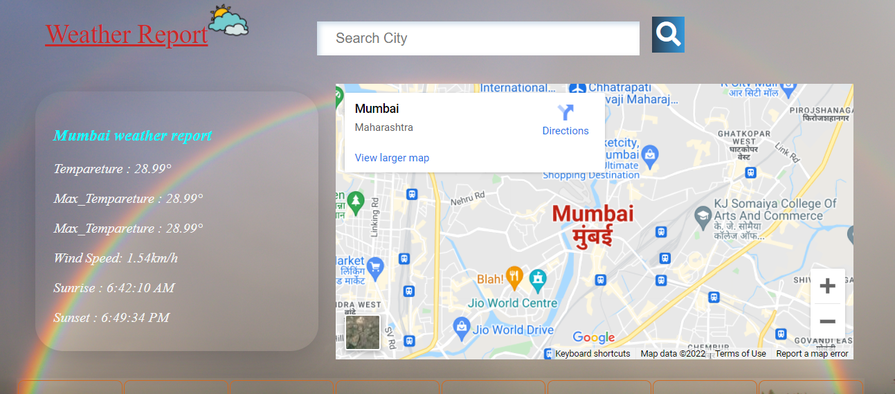
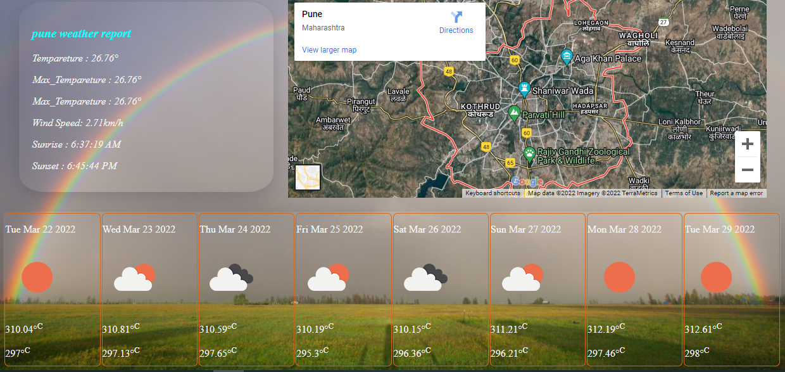

# Weather Map Web Application 
In this project I have made a weather search web application. With efforts and the technology stack, that I have learned during curriculum of unit 3 so far in the masai school.

## Deployment Link
https://weatherapp-ten-kappa.vercel.app/

## About the Project
A Weather search web application, where user will get location based weather report. Here user will get all info related to a particular city with daily report and weekly report.

This is home page of weather map web application.

## Tech Stack used in this Project
- JavaScript
- HTML
- CSS
- API's

Showing daily forecast of city along with the map.

